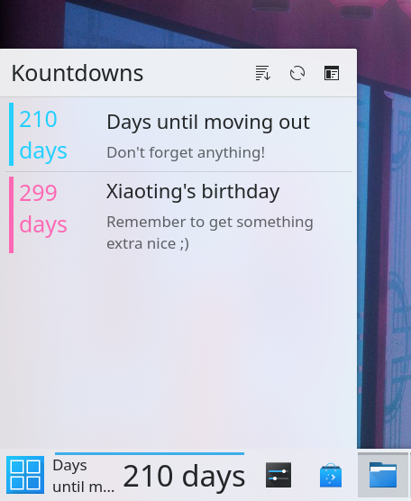

# DayKountdown-Plasmoid

# Note: This repository is now hosted on KDE's Invent GitLab instance. It can be found [here](https://invent.kde.org/clau-cambra/daykountdown-plasmoid). 

A complementary KDE Plasma desktop widget for [DayKountdown](https://github.com/elChupaCambra/DayKountdown).

*Note: this widget requires [DayKountdown](https://github.com/elChupaCambra/DayKountdown) to be installed for it to work correctly.*

It is written in QML and C++.

## Features

- Can be used in its full form on the desktop or as an expandable compact widget in the desktop panel
- Customisable sorting order, with sorting by date, name, and creation time
- Quick access to the full Daykountdown application

## Prerequisites

- A Linux install
- Qt5 packages from your distribution's repositories
- KDE packages (including Kirigami)
- CMake

## Compiling and installing

First, clone this repository through the terminal by running:

`git clone https://github.com/elChupaCambra/DayKountdown-Plasmoid.git`

Then enter the cloned repo directory and create a new folder called `build`. 

Then, enter this folder:

`mkdir build && cd build`

Once that's done just run `cmake`, pointing it at the root repository directory:

`cmake ..`

Finally, all we need to do is run make:

`make`

`make install`

DayKountdown-Plasmoid should now appear in your list of widgets as `dkplasmoid`!
